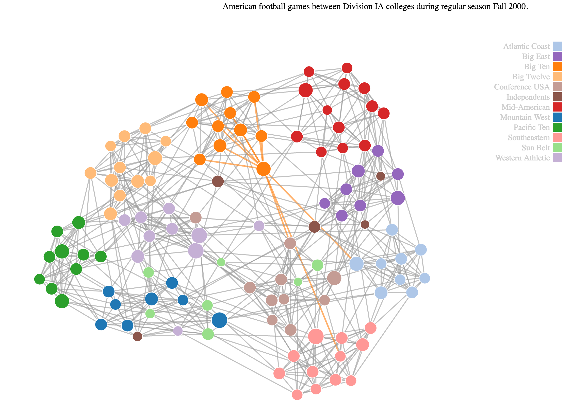

# data-visualization-week3-assignment
## American football games between Division IA   colleges during regular season Fall 2000

### What is the data that you chose? Why?

You are looking at a undirected force graph data visualization from American football games between Division IA colleges during regular season Fall 2000. As originally visualized [here](http://networkdata.ics.uci.edu/data/football/football.png). I took this dataset because it was a complex set to visualize because of the many nodes and the great overlap. Also the original set leaves out many visualization details such as grouping, size and clustering.

### Did you use a subset of the data? If so, what was it?

No, I used the full data set as available from this [link](https://networkdata.ics.uci.edu/data.php?id=5).

### Are there any particular aspects of your visualization to which you would like to bring attention?

To improve the visualization and make it more clear:
 - Colors (Hue,): I've used colors to indicate which conferences the nodes belong to. The colors corespondent to the colors as seen in the legenda on the right.
 - Labels: The labels are left out initially to avoid an over crowded graph. You may hoover the nodes to see the college and how many opponents they have (not available on screenshot).
 - Clustering: All nodes are clustered by conferences, all nodes of the same conference are drawn in the same area.
 - Node sizes :  Another visual enhancement this graph has are the node sizes. Small nodes have played less games, larger nodes play more.

The legenda is made interactive:
- You can toggle the visibility of clusters by data by clicking on the desired zone. By enabling clusters you can see if colleges tend to play each other or more outside of their conference.

The chart is made interactive:
 - Hovering a node will show the college name and total links it has.
 - Hovering a node will highlight and color the links to it's linked nodes.
 - Hovering a node will temporary enlarge a node.

By using density, saturation, hue, color, area, length, interaction and filters it allows the user to understand the data quite better then the original graph.

### What do you think the data and your visualization show?

- Colleges on the outer edge of their cluster are less likely to play colleges from other clusters then their peers facing the center.
- LouisianaTech, Western Athletic (most center of graph) plays games against various conferences.
- Utahstate, Independends, is more likely to play against Mountain West, Pasific Ten and Sun belt.
- Pittsbourg (the purple node in the red cluster), is has played more Mid-American colleges then the rest of the Big East colleges.
- Pasific ten and Mid-American are less likely to play against each other, as will Atlantic Coast and Big Twelve, since they are on opposite sides.
- Colleges with colors with conferences "Independents" and "Sun belt" are less likely to play colleges in the same conference. Since their cluster is quite large and they are scattered all over the graph.

### Screenshots

Pittsbourgh highlighted

Mid American and Pacific ten are less likely to play vs each other

All clusters shown

Independends clusters shown

Copyright (c) 2016 Antek Drzewiecki
